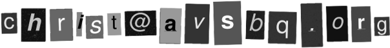

# How to send a message in a bottle to me

## Digitally

- main email
	- 
	- not up yet 
	- don't use, will bounce back
- secondary emaiil
	-  dawn1000 (at]protonmail[dot]com - use for time being Primary

No response? Check spam box, sometimes my mail is routed there.

## Notice !

A guy on TikTok share's the same <ruby>moniker<rt>avsbq</rt></ruby> as me.

It's just random letters, there must be a couple others of our kind...
